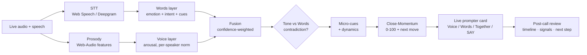

# Voice Hotspot — real-time conversation co-pilot

> A live "second brain" for high-stakes conversations. It listens to a call and reads the person across from you **two independent ways** — from their **words** (NLP/LLM) and their **voice tone** (prosody) — fuses the two, flags the moments where **tone contradicts words**, and turns each signal into one clear next move. Built for sales, negotiation, interviews, and business meetings.

-lightgrey)

**This is a public showcase of a private project.** The full source lives in a private repository — happy to walk through the code or give access on request.

---

## The idea

Humans miss most of what happens in a live conversation — the micro-pause before a "yes", the energy dropping two questions ago, the enthusiastic words delivered in a flat tone. Voice Hotspot is a co-pilot that catches those cues in real time and hands you a single, explainable next move — never a full transcript to read, only *the moments that matter*.

The core bet: **emotion read two independent ways is far more trustworthy than either alone.** When the words say "sounds good" but the voice says otherwise, that contradiction is often the most important signal in the call.

---

## What makes it interesting (engineering)

- **Dual-signal emotion fusion.** A text layer (LLM + linguistic cues) and a voice layer (prosody) are computed independently, then combined with confidence weighting. A dedicated stage detects **tone-vs-words contradiction** and raises it as its own signal.
- **A calibrated voice model with honest, measured numbers.** Binary arousal (activated vs calm) is trained and evaluated **speaker-independently on RAVDESS** — not hand-waved. See the accuracy table below.
- **Per-speaker baselining, live.** The product builds a rolling baseline per speaker over the call and asks "is *this* turn more activated than *their* usual?" — the normalization that lifts shipped accuracy to 86.2% (F1 88.4%).
- **A resilient, free-first provider router.** `_llm.js` is a fallback chain with a **debounce + circuit-breaker**: it batches turns, caps the rate, and after repeated failures backs off to a local engine for a cooldown, so a rate-limited free tier never spirals into 429s. **The product never hard-fails and works with zero API keys.**
- **A domain-pack architecture.** One analysis core + a swappable taxonomy/framing/**local coaching rules** per domain (Sales · Negotiation · Interview · General). Switching domain re-tailors both the LLM prompt *and* the offline coaching.
- **A Chrome MV3 extension** that captures a Meet/Zoom tab's audio via `chrome.tabCapture` (offscreen document), runs the same prosody pipeline, scrapes live captions as a free remote transcript, and overlays a draggable prompter.

---

## Live data flow

---

## Voice calibration (measured, not claimed)

Methodology: binary **arousal** (activated vs calm), **speaker-independent** split on **RAVDESS** (train actors 1–18, held-out test 19–24). A per-speaker baseline forms over the first turns; a cold-start model (~83% F1) covers until then. Numbers are from the project's own evaluation harness:

| Approach | Held-out test accuracy |
|---|---|
| Hand-weighted baseline | 65.7% |
| Prosodic features + MLP (speaker-independent) | 81.7% (F1 85.1%) |
| **+ per-speaker normalization (shipped)** | **86.2% (F1 88.4%)** |

**What was tested:** binary arousal (activated vs calm) on **RAVDESS** — 1,440 acted clips, split **speaker-independently** (train on actors 1–18, evaluate on held-out actors 19–24). Reported metrics are accuracy and F1 on that held-out test set. **Limitations:** RAVDESS is *acted* emotion, not spontaneous conversation; only binary arousal is evaluated here (valence from voice alone is much weaker, ~67%, which is exactly why words and tone are fused); and hand-crafted prosody plateaus near this range — richer deep features overfit speaker identity unless per-speaker normalized. Full evaluation scripts live with the private source; MELD sanity-checks the text layer. These are the project's own internal figures, not an external benchmark.

---

## What it surfaces, live

| Layer | Signal |
|---|---|
| **Words** | emotion + intent + linguistic cues (hedging, commitment, objections, buying signals) |
| **Voice** | prosody — pitch, energy, rate, pauses → arousal (calibrated) |
| **Fused** | confidence-weighted combination + tone-vs-words contradiction |
| **Micro-cues** | per-speaker baseline deviations: energy decline, micro-pause before "yes", slowing, pitch spikes |
| **Dynamics** | talk ratio, momentum (improving / declining) |
| **Close-Momentum** | one 0–100 score blending every signal, with the single recommended next move |

---

## Tech stack

**Frontend** vanilla JS + Web Audio API (no framework) · dark "glass" UI · draggable live prompter
**Backend** Node.js serverless functions (Vercel) · also served locally by a plain `server.js`
**AI routing** Claude · Gemini · Groq · OpenRouter → local rules engine (language-aware, circuit-broken)
**Speech** Web Speech API (free) or Deepgram (upgrade) with diarization
**Voice tone** calibrated Web-Audio model (free) or Hume (upgrade)
**Extension** Chrome MV3 · `tabCapture` + offscreen document · caption scraping

Runs fully offline in "demo mode" with **no keys and no microphone** — API keys only *upgrade* the phrasing.

---

## Design principles

- **Signal over noise** — surface only decoded moments, never a wall of transcript.
- **Explainable by default** — every card names the *why* and the framework behind it.
- **Free-first & resilient** — a useful product at zero cost; paid keys are pure upgrades.
- **Probabilistic attention signals, never verdicts** — emotion/contradiction reads are cues, **not lie-detection**, and the tool is built to respect consent and local recording law.

---

*Voice Hotspot · built by [tklroei1](https://github.com/tklroei1). Source is private.*
